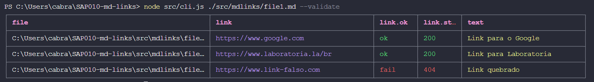
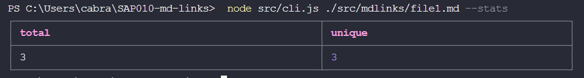
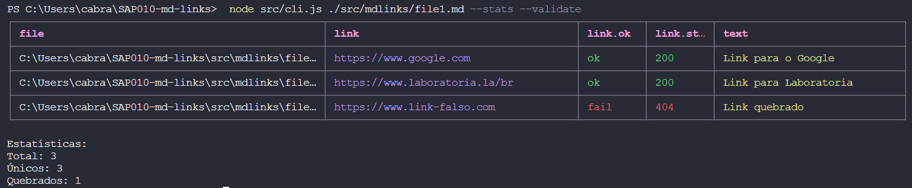

# Markdown Links
## 1. Introdução
O Markdown Links é uma sofisticada biblioteca desenvolvida com a nobre finalidade de facilitar e aprimorar a leitura e verificação de hiperlinks contidos em documentos formatados em Markdown (com extensão .md). Essa poderosa ferramenta opera com primor por meio de uma interface de linha de comando (CLI), garantindo a máxima versatilidade e tornando-se uma escolha altamente recomendável tanto para projetos Node.js quanto para aplicações em ambiente de terminal.

A dextreza dessa biblioteca permite que ela examine com maestria um arquivo .md, perscrutando sua estrutura de forma diligente e extrair com sagacidade todos os elos presentes. Além disso, destaca-se a sua capacidade opcional de validar, através de requisições HTTP, cada elo encontrado, a fim de aferir a sua vitalidade e resiliência diante da vastidão da internet. Destarte, é possível identificar com excelência quais elos estão vigorosos e quais, lamentavelmente, jazem quebrados.

Para aqueles que anseiam por detalhes precisos e concisos, o Markdown Links propicia um vasto leque de estatísticas valiosas. Por meio dele, é factível determinar, com magnificência, o número total de elos presentes no documento, bem como discernir os elos únicos, o que provém de uma lucidez admirável para aqueles que desejam compreender o cenário completo dos seus vínculos. De forma igualmente relevante, ele capacita a percepção dos elos que jazem quebrados, desvelando assim a imperfeição momentânea ou a incompletude das conexões.

Em suma, a biblioteca Markdown Links é um verdadeiro deleite para os entusiastas da eficiência e da precisão. Seu talento incontestável para analisar, validar e fornecer informações concisas sobre os elos contidos em documentos Markdown torna-a uma ferramenta imprescindível para todo aquele que almeja desbravar as entranhas de suas referências e assegurar a integridade e vitalidade dos seus vínculos digitais.

## 2. Instalação e Uso ✅
### 2.1 Instalação
Para instalar a biblioteca, basta utilizar o gerenciador de pacotes npm. No terminal, execute o seguinte comando:

```bash
npm install md-links-vitcbrl
```

### 2.2 Utilização
Após a instalação, você poderá usar o Markdown Links através da CLI, executando o seguinte comando:

```bash
mdlinks <caminho-do-arquivo> [--validate] [--stats]
```

Onde:

- `<caminho-do-arquivo>`: O caminho para o arquivo .md que deseja analisar.
- `--validate` (opcional): Realiza a validação dos links, exibindo o status de cada link (ativo ou quebrado).
- `--stats` (opcional): Exibe estatísticas dos links, como o total de links e links únicos.

Exemplo:

```bash
mdlinks ./meu-arquivo.md --validate --stats
```

Agora você está pronto para explorar e analisar os links em seus arquivos Markdown com facilidade e praticidade!

## 3. Funcionalidades 
### 3.1 Validação de links 
Ao empregar a opção --validate na linha de comando (CLI), a biblioteca executará a verificação dos links encontrados por meio de solicitações HTTP. Essa ação tem o propósito de determinar se os links estão funcionando corretamente ou se apresentam problemas. Os links que se mostrarem funcionais receberão o rótulo "ok" e o número "200", enquanto aqueles que não estiverem acessíveis serão marcados como "fail" e o número "404".



### 3.2 Estatísticas de Links
Ao selecionar a opção --stats ao utilizar a linha de comando (CLI), a biblioteca apresentará informações estatísticas referentes aos links identificados no arquivo. Essas estatísticas compreenderão tanto a contagem total de links quanto a quantidade de links distintos encontrados.



### 3.3 Validação e Estatísticas de Links
Ao empregar conjuntamente as opções --validate e --stats na interface de linha de comando (CLI), a biblioteca proporcionará uma análise abrangente. Isso abrangerá não apenas a exibição das estatísticas relativas aos links descobertos, incluindo sua quantidade total e a contagem de links únicos, mas também envolverá a verificação individual da validade de cada link encontrado. Nesse processo, os links serão minuciosamente testados para determinar se estão ativos ou apresentam falhas, conferindo assim um panorama completo sobre a saúde e a integridade dos links contidos no arquivo.




